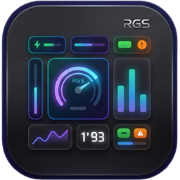
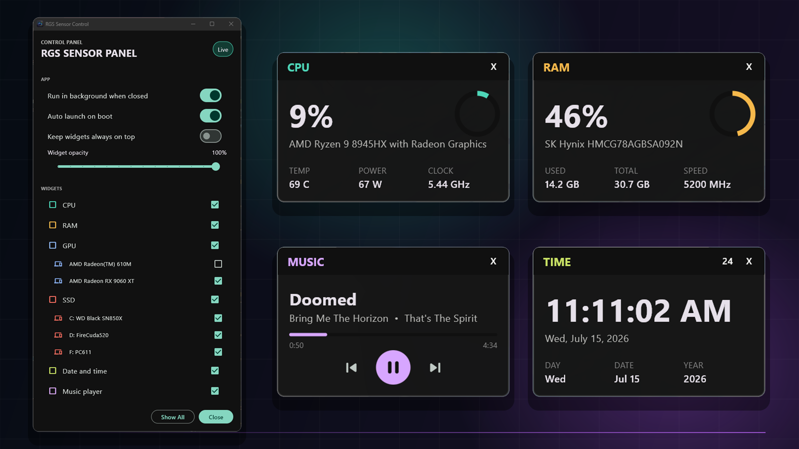

<p align="center">
  
</p>

<h1 align="center">RGS Sensor Panel</h1>

<p align="center">
  Lightweight, independently movable hardware and media widgets for Windows.
</p>

<p align="center">
  
  
  
</p>

<p align="center">
  
</p>

RGS Sensor Panel opens with one control panel for managing Rainmeter-style CPU,
RAM, GPU, SSD/storage, date/time, and Windows media widgets. Every widget moves
independently, while the hardware backend runs separately only when sensor
access is enabled.

```text
Flutter UI -> Dart HttpClient -> http://127.0.0.1:8095/data.json -> rgs-sensor-backend.exe
```

## Project Layout

- `flutter_desktop/` - Flutter Windows UI, tray behavior, widgets, settings, and asset bundle.
- `sensor_backend/` - C# LibreHardwareMonitor backend used for elevated hardware sensor readings.
- `installer/` - Inno Setup script for the Windows installer.
- `.github/workflows/release.yml` - Tag release workflow for portable zip and installer builds.

## Run From Source

Build the backend first so Flutter can bundle and start it:

```powershell
dotnet build .\sensor_backend\RgsSensorBackend.csproj -c Release
```

Then run the Flutter app:

```powershell
cd .\flutter_desktop
flutter pub get
flutter run -d windows
```

## Build

```powershell
dotnet build .\sensor_backend\RgsSensorBackend.csproj -c Release
cd .\flutter_desktop
flutter build windows --release
```

The built app is at:

```powershell
.\flutter_desktop\build\windows\x64\runner\Release\rgs_sensor_panel_flutter.exe
```

## Firebase Config

`flutter_desktop/lib/firebase_options.dart` is generated by FlutterFire and is
ignored by git. Do not commit it.

For local development, generate it inside `flutter_desktop/`:

```powershell
flutterfire configure --project=rgs-sensor-panel --platforms=windows
```

For GitHub Actions releases, the workflow generates it from the
`FIREBASE_SERVICE_ACCOUNT_JSON` repository secret before running analyze, tests,
and the Windows build.

## Release

Pushing a git tag builds a GitHub Release with both a portable zip and an Inno
Setup installer exe:

```powershell
git tag v1.0.0
git push origin v1.0.0
```

## Controls

- CPU, RAM, grouped GPU, grouped SSD/fixed-drive, date/time, and music controls open as Rainmeter-style widgets.
- The music widget shows the current track and controls previous, play/pause, and next when supported by the media app.
- Drag any widget to move it independently.
- Use the widget buttons on GPU/SSD windows to show or hide individual devices and readings.
- Use the `12`/`24` button on the time widget to switch clock format.
- Use the tray menu to open the control panel or exit the app.
- The control panel can show or hide whole widgets and individual GPU/SSD rows.
- The control panel can toggle always-on-top, widget opacity, tray-on-close behavior, and auto launch on boot.
- Boot launches start in the tray only and do not open the control panel.
- The control panel support footer links to Ko-fi, YouTube, and GitHub Sponsors.
- The first launch asks whether to enable the elevated background hardware sensor task.

## Live Metrics

- CPU usage, processor name, clock, temperature, and power when available
- Grouped per-GPU usage, clock, temperature, and power when available
- RAM usage, physical RAM brand/part when Windows exposes it, and configured RAM speed
- Grouped per-drive SSD/storage usage and disk read/write rate
- Date, time, and day
- Active Windows media-session title, artist, album, playback progress, and transport controls

## Notes

This app does not use AIDA64, Rainmeter, or HWiNFO. Normal load, memory, and
disk readings come from Windows APIs and performance counters.

The music widget uses Windows system media sessions, so it works with apps such
as Spotify and browsers when they publish media controls to Windows. It does not
depend on the elevated hardware sensor backend.

Hardware temperatures use `rgs-sensor-backend.exe`, a local headless backend
built on LibreHardwareMonitorLib. The panel quietly reuses an existing elevated
scheduled task when it exists. It does not request admin access at startup.

On first launch, the app asks once whether to enable background hardware
sensors. If you approve the Windows UAC prompt, the app registers `RGS Sensor
Panel Hardware Sensor Backend` as an elevated per-user scheduled task and starts
it. After that, launches should not ask again unless the task is deleted or you
enable sensors again from the control panel.
